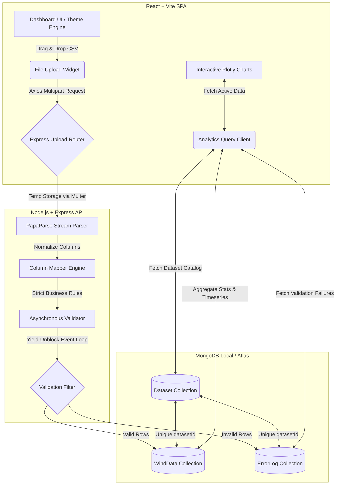

# Wind Analytics & Data Platform 🌬️📊

Welcome to the **Wind Analytics & Data Platform**, a modern, high-performance web application built with **React, Vite, Node.js (Express), and MongoDB**. This platform enables wind farm operators and data engineers to upload, validate, store, and dynamically visualize complex telemetry datasets captured from wind mast sensors at various altitudes.

---

## 🏗️ Project Architecture & Data Flow

Below is the end-to-end data flow showing how datasets are uploaded, parsed, validated, stored in MongoDB with isolation, and fetched dynamically by the frontend:



---

## ✨ Key Features

### Ingestion & Pipeline Ingestion
- **Modern Drag & Drop CSV Ingestion:** Drag-and-drop file interface with stages including *Uploading file*, *Parsing CSV*, *Validating rows*, *Saving to database*, and *Completed*.
- **Dataset Isolation:** Each upload generates a unique `datasetId`. Dashboard cards, analytics, trends, and error logs are isolated to the active dataset, preventing records from bleeding into each other.
- **Asynchronous Batch Processing:** Bulk inserts (`insertMany`) in chunks of 1000 rows. The Event Loop is released periodically using `setImmediate` to prevent blocking when processing heavy datasets.
- **Strict Data Validation Rules:**
  - `timestamp`: Checked for existence and formatting (`DD-MM-YYYY HH:mm`).
  - `windSpeed`: Dynamically detected by suffixes (e.g. `[m/s]`, `avgms`, `speed`). Values must be between `0` and `60` m/s.
  - `windDirection`: Dynamically detected (e.g. `[°]`, `wv`, `direction`). Values must be between `0` and `360` degrees.
  - Malformed or blank values are rejected and stored cleanly in an `ErrorLog` collection for auditing.

### Interactive Dashboard & Analytics
- **Dynamic Chart Layout:** Uses 100% dashboard width and supports full responsiveness (responsive resizing, box-select, zoom, pan, reset zoom, and download as PNG).
- **Multi-Overlay Time Series Charts:** Plot multiple metrics from the same category (e.g., wind speed sensors at 100m, 80m, 50m, 20m) together on a single line timeline.
- **Dynamic Metric Classification:** Columns are scanned at runtime. No hardcoding! Suffixes are mapped to specific categories:
  - **Wind Speed (`[m/s]`)** — Supports multi-selection checkboxes.
  - **Wind Direction (`[°]`)** — Supports multi-selection checkboxes.
  - **Temperature (`[°C]`)** — Single-selection chips panel.
  - **Humidity (`[%]`)** — Single-selection chips panel.
  - **Pressure (`[mbar]`)** — Single-selection chips panel.
  - **Additional Metrics (Others)** — Custom columns displayed dynamically.
- **Telemetry Card Panels:** Real-time minimum and maximum calculations displayed in glassmorphic telemetry cards directly above the Plotly chart.
- **Correlation Scatter Workspace:** Explore correlations between any two selected columns with a customizable **linear regression trendline** toggle.

---

## 📂 Project Structure

```text
Wind-Data-platform/
├── README.md                  # This root documentation file
├── test_wind_data.csv         # Small dataset to test ingestion
├── server/                    # Backend API Service
│   ├── .env.example           # Reference environmental variables
│   ├── index.js               # Entry point requiring src/server.js
│   ├── src/
│   │   ├── app.js             # Express app & middleware setups
│   │   ├── server.js          # DB connector and port listener
│   │   ├── config/            # DB configuration details
│   │   ├── controllers/       # Business logic (Ingestion & Analytics)
│   │   ├── models/            # Mongoose Schemas (Dataset, WindData, ErrorLog)
│   │   ├── routes/            # Route routing paths
│   │   └── utils/             # Helper mapping & validation utilities
│   └── package.json           # Backend dependencies and scripts
└── frontend/                  # React + Vite Client Application
    ├── index.html             # Client HTML container
    ├── vite.config.js         # Vite settings
    ├── src/
    │   ├── App.jsx            # Core dashboard layout shell
    │   ├── components/        # UI components (Header, Upload, Graph, Audit)
    │   ├── data/              # Mock layouts and constants
    │   └── index.css          # Theme tokens and global stylesheets
    └── package.json           # Frontend dependencies and scripts
```

---

## 🚀 Local Run & Setup Instructions

Follow these steps to get the environment running on your local machine:

### Prerequisites
Make sure you have the following installed:
- **Node.js** (v18.x or above recommended)
- **npm** (v9.x or above)
- **MongoDB Server** (Running locally on default port `27017` or a remote Atlas connection URI)

---

### 1. Setup Backend Server

1. Navigate to the `server/` directory:
   ```bash
   cd server
   ```

2. Install backend dependencies:
   ```bash
   npm install
   ```

3. Configure environment variables:
   - Duplicate `.env.example` and rename it to `.env`:
     ```bash
     cp .env.example .env
     ```
   - Open `.env` and verify the values:
     ```env
     PORT=5000
     MONGODB_URI=mongodb://localhost:27017/wind_data_db
     ```
     *(Note: If using Node.js 17+, you can use `mongodb://127.0.0.1:27017/wind_data_db` to bypass IPv6 resolution quirks).*

4. Launch the backend server:
   - **Development mode** (with hot-reload via nodemon):
     ```bash
     npm run dev
     ```
   - **Production mode**:
     ```bash
     npm start
     ```

   *The terminal will confirm connection:*
   ```text
   ✅ Server running at http://localhost:5000
   MongoDB connected
   ```

---

### 2. Setup Frontend Client

1. Open a new terminal and navigate to the `frontend/` directory:
   ```bash
   cd frontend
   ```

2. Install client dependencies:
   ```bash
   npm install
   ```

3. Launch Vite development server:
   ```bash
   npm run dev
   ```

4. Open your browser and navigate to the displayed URL (typically [http://localhost:5173/](http://localhost:5173/)).

---

## 🧪 Testing Ingestion

To verify the pipeline:
1. In the Dashboard header, click on **Upload Dataset**.
2. Drag and drop the test file [test_wind_data.csv](file:///c:/Vayumitra/DEV/My_work/Wind-Data-platform/test_wind_data.csv) from the root folder, or click to select it.
3. Once completed, the dashboard cards (Total Records, Valid, Invalid, Averages) will dynamically update.
4. Navigate through the **Wind Speed**, **Temperature**, **Humidity**, and other tabs in the workspace section to view the plotted data.
5. Check the **Audits & Errors** panel at the bottom to see detailed logs for rows that failed validation (such as out-of-bounds speed entries).

---

## 🔌 API Endpoints Summary

| Endpoint | Method | Description |
| :--- | :--- | :--- |
| `/api/upload` | `POST` | Upload CSV dataset. Accepts `file` via `multipart/form-data`. |
| `/api/analytics/datasets` | `GET` | Returns list of all uploaded datasets in database. |
| `/api/analytics/summary` | `GET` | Returns aggregates for the active dataset (optionally filter with `?datasetId=...`). |
| `/api/analytics/timeseries` | `GET` | Returns sorted timeseries data (optionally filter with `?datasetId=...` and `?limit=...`). |
| `/api/analytics/errorlogs` | `GET` | Returns the first 100 invalid record error logs for a dataset. |
| `/health` | `GET` | Basic health monitoring endpoint. |

---


