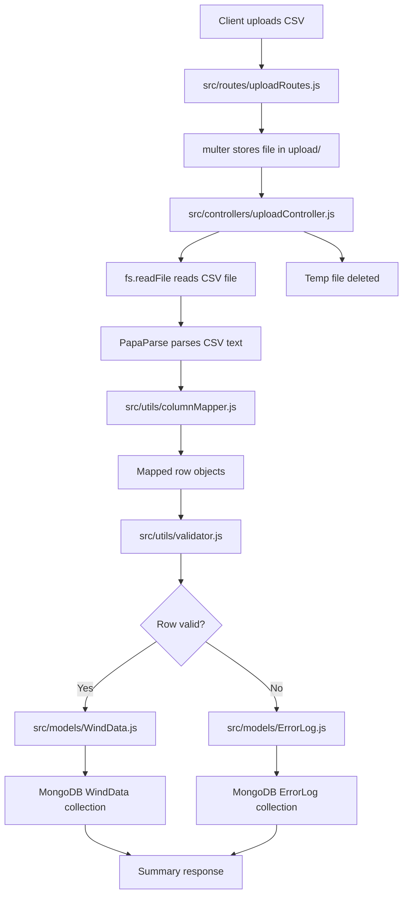

# Wind Data Platform — Backend README

This README summarizes the CSV ingestion pipeline, how each module works, and step-by-step request flow for the Wind Data Platform backend. It is written to be beginner-friendly and interview-ready.

**Contents**
- CSV upload flow
- Multer logic
- PapaParse parsing logic
- Dynamic column mapping logic
- Validation logic
- Error logging logic
- MongoDB storage logic
- Difference between valid rows and invalid rows
- Why separate collections are used
- Complete request flow from CSV upload to database storage
- Why each module is needed
- How the validator works
- How dynamic schema mapping works
- Engineering problems this architecture solves
- Quick run / test commands

---

**CSV Upload Flow (High level)**
1. Client sends `POST /api/upload` with a CSV file (multipart/form-data).
2. `multer` (route middleware) saves the file to the `upload/` folder.
3. Controller reads the temporary file and uses `PapaParse` to parse rows with `header: true`.
4. `columnMapper` normalizes header names and produces standardized row objects.
5. `validator` checks each row for timestamp, wind speed/direction ranges, and missing values.
6. Valid rows are transformed into `WindData` documents and bulk-inserted.
7. Invalid rows are recorded as `ErrorLog` documents and bulk-inserted.
8. The temporary upload file is removed and the API returns a summary JSON response.

---

**Multer logic**
- Location: `src/routes/uploadRoutes.js`.
- Purpose: Accepts multipart uploads, stores a file on disk, and exposes `req.file` to the controller.
- CSV-only policy: The route's file filter checks the uploaded filename and mimetype, allowing only CSV.
- Why: Express doesn't parse multipart file uploads; `multer` is lightweight and reliable for saving files for later processing.

---

**PapaParse parsing logic**
- Location: `src/controllers/uploadController.js` (parsing helper).
- How it’s used: The controller reads the file (UTF-8) and invokes `Papa.parse(csvText, { header: true, skipEmptyLines: true })`.
- Output: an array of row objects where keys are the original CSV headers.
- Why: `PapaParse` produces robust parsing (handles quoted fields, newlines in quoted fields, and large files) with a minimal API.

---

**Dynamic Column Mapping logic**
- Location: `src/utils/columnMapper.js`.
- Purpose: Normalize and standardize arbitrary CSV headers into application field names.
- Rules applied:
  - Lowercase the header
  - Remove spaces
  - Remove special characters
  - Check an internal alias map for known names (e.g., `date/time` -> `timestamp`)
  - Convert unknown but safe names to camelCase
- Alias examples:
  - `date/time` -> `timestamp`
  - `100m_n_avg_[m/s]` -> `windSpeed100m`
  - `80m_avg_[m/s]` -> `windSpeed80m`
  - `temp_5m_[c]` -> `temperature`
  - `hum_5m_[%]` -> `humidity`
- Why dynamic mapping: Real-world CSVs vary; mapping lets the ingestion pipeline accept multiple export formats without custom adapters.

---

**Validation logic**
- Location: `src/utils/validator.js`.
- Output format: `{ valid: true|false, errors: [] }` per-row (and overall summary functions).
- Rules enforced:
  1. `timestamp` must exist and parse to a valid `Date`.
  2. Wind speeds (any field that looks like a wind speed) must be between 2 and 60 m/s.
  3. Wind directions (dynamic detection) must be between 0 and 360.
  4. Missing/blank values are flagged as errors.
- Dynamic detection:
  - Validator inspects normalized field names and identifies wind speed/direction fields by pattern matching (e.g., includes `speed`, `direction`, `windspeed`, `winddir`, etc.).
- Why: This keeps the validator robust across different column naming conventions while ensuring business rules are enforced consistently.

---

**Error logging logic**
- Location: `src/models/ErrorLog.js` and used in `src/controllers/uploadController.js`.
- What gets stored:
  - `rowNumber` (1-based index of the failed row)
  - `validationErrors` (array of human-readable reasons)
  - `rawRowData` (original parsed CSV row before mapping or after mapping based on design)
  - `createdAt/updatedAt` timestamps
- Why: Failed rows are preserved for debugging, re-processing, or informing the data provider of issues.

---

**MongoDB storage logic**
- Models:
  - `WindData` (`src/models/WindData.js`): stores `timestamp`, `windSpeeds` (Map), `windDirections` (Map), `humidity`, `temperature`, `rawRowData`, plus `timestamps: true`.
  - `ErrorLog` (`src/models/ErrorLog.js`): stores `rowNumber`, `validationErrors`, `rawRowData`, plus `timestamps: true`.
- Bulk insertion: `insertMany(..., { ordered: false })` is used to speed up writes and continue on duplicates or partial write errors.
- Why MongoDB: flexible schema (Maps and Mixed types) fits CSV variability and allows fast ingestion and querying on time-based fields.

---

**Difference between valid rows and invalid rows**
- Valid rows: rows that meet all validation rules; inserted into the `WindData` collection and used in analytics.
- Invalid rows: rows that fail validation; inserted into `ErrorLog` with details to facilitate repair.
- Key benefit: clean data for analytics while preserving bad data for auditing.

---

**Why separate collections are used**
1. Query performance: `WindData` remains clean and small for analytics queries.
2. Auditability: `ErrorLog` preserves original failing records and full error context.
3. Separation of concerns: different consumers use each dataset (analytics vs. debugging).
4. Safety: No accidental inclusion of malformed rows in analytics or ML pipelines.

---

**Complete request flow from CSV upload to DB storage (detailed)**
1. Client `POST /api/upload` with `file` field.
2. Upload route runs multer middleware which saves the file to `upload/`.
3. Controller confirms the file exists at `req.file.path`.
4. Controller reads file via `fs.readFile` (UTF-8) and hands content to `Papa.parse`.
5. `Papa.parse(..., { header: true })` returns parsed rows (array of objects keyed by CSV headers).
6. `columnMapper.mapWindTurbineCsvRows(parsedRows)` returns standardized rows.
7. For each standardized row:
   - Run `validator.validateWindTurbineRow(row, index)`.
   - If valid: transform row into `WindData` document (maps and numeric conversion) and add to `validDocuments`.
   - If invalid: assemble an `ErrorLog` document and add to `invalidDocuments`.
8. Use `WindData.insertMany(validDocuments, { ordered: false })` to bulk write valid rows.
9. Use `ErrorLog.insertMany(invalidDocuments, { ordered: false })` to bulk write invalid rows.
10. Delete the temporary uploaded file and return summary JSON `{ totalRows, validRows, invalidRows }`.

---

**Complete flowchart of files involved**



**File-by-file path**
- `src/routes/uploadRoutes.js`: receives the request and runs `multer`.
- `src/controllers/uploadController.js`: reads, parses, maps, validates, stores, and responds.
- `src/utils/columnMapper.js`: normalizes and standardizes headers.
- `src/utils/validator.js`: checks row rules and produces errors.
- `src/models/WindData.js`: stores valid turbine data.
- `src/models/ErrorLog.js`: stores invalid rows and error details.
- `upload/`: temporary file storage directory.
- `package.json`: provides `start` and `dev` scripts.

---

**Why each module is needed (quick)**
- `routes/uploadRoutes.js`: route + multer middleware.
- `controllers/uploadController.js`: orchestrates parse->map->validate->store.
- `utils/columnMapper.js`: normalizes arbitrary CSV headers.
- `utils/validator.js`: implements business rules and dynamic detection.
- `models/WindData.js`: stores cleaned, validated data.
- `models/ErrorLog.js`: stores failed rows for later inspection.

---

**How the validator works (implementation notes)**
- Helper checks: `isBlank`, `isValidDate`, `isValidNumber`.
- Dynamic detection helpers: `isWindSpeedField(fieldName)` and `isWindDirectionField(fieldName)`.
- For each row:
  - Validate `timestamp` existence and parseability.
  - Gather wind speed fields and verify numeric range `[2, 60]`.
  - Gather wind direction fields and verify numeric range `[0, 360]`.
  - Accumulate human-readable errors with row numbers.
  - Return `{ valid, errors }`.

---

**How dynamic schema mapping works (implementation notes)**
- Normalization pipeline:
  1. Convert header to string and lowercase.
  2. Strip whitespace and non-alphanumeric characters.
  3. Look up in a small alias table (explicit mappings for common variants).
  4. For unknown headers, return a camelCased normalized name.
- Maps keep unknown columns so data is not lost when new fields appear.

---

**Engineering problems this architecture solves**
- Vendor heterogeneity in CSV header naming.
- Easily auditable ingestion: invalid rows are logged with errors.
- Scalable bulk writes for large uploads.
- Flexible schema for incremental feature additions.
- Clean separation between ingestion, validation, and storage.

---

## Quick run & test

1. Copy `.env.example` to `.env` and set `MONGODB_URI`.

```bash
cd server
npm install
# set up .env with MONGODB_URI
npm run dev
```

2. Example curl (replace host/port if needed):

```bash
curl -X POST -F "file=@/path/to/data.csv" http://localhost:5000/api/upload
```

Expected JSON response example:

```json
{
  "success": true,
  "totalRows": 200,
  "validRows": 180,
  "invalidRows": 20
}
```

---

## Next steps / suggestions
- Add unit tests for `columnMapper` and `validator`.
- Add integration test that uploads a small CSV and verifies DB writes.
- Add pagination and APIs to read `ErrorLog` and reprocess entries.
- Consider streaming large CSVs instead of reading full file into memory.

---

File references:
- `src/routes/uploadRoutes.js`
- `src/controllers/uploadController.js`
- `src/utils/columnMapper.js`
- `src/utils/validator.js`
- `src/models/WindData.js`
- `src/models/ErrorLog.js`

---

If you'd like, I can also:
- Add a simple integration test script that submits a sample CSV and checks the DB,
- Add an admin endpoint to download `ErrorLog` entries for debugging,
- Or render a Mermaid flow diagram of the pipeline.

